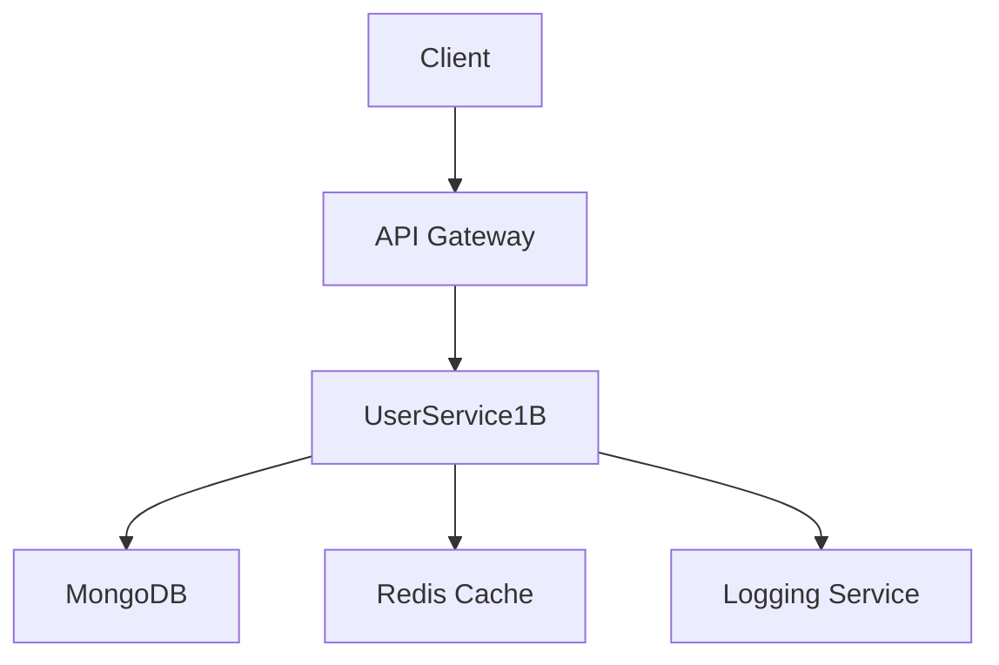
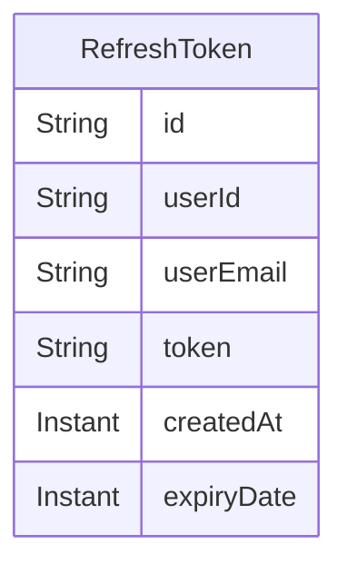
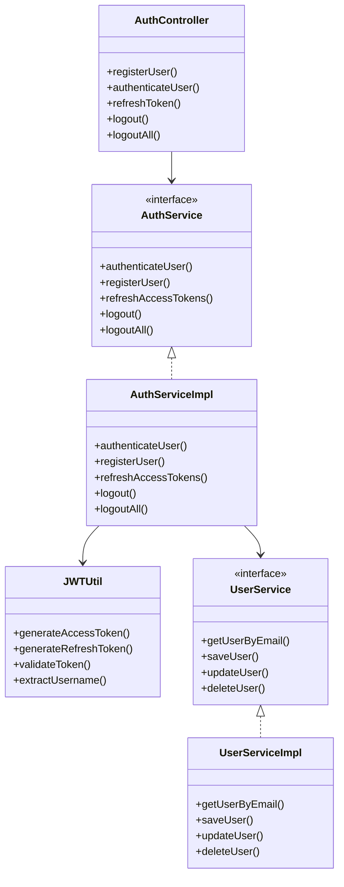
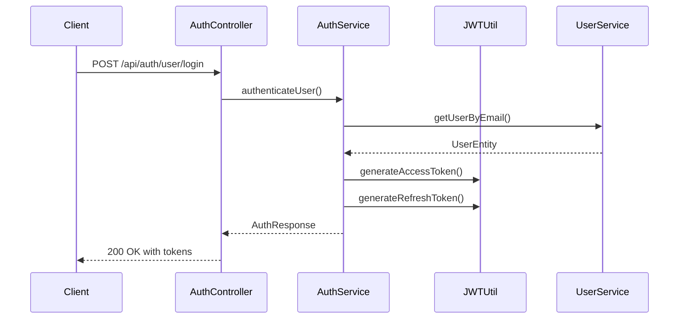
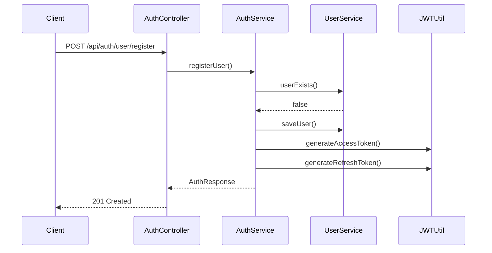

# UserService1B - User Management Microservice

## Overview
UserService1B is a Spring Boot microservice that provides user management functionality with JWT-based authentication and role-based access control. It's part of an e-commerce system and handles user registration, authentication, and authorization.

## Table of Contents
1. [Architecture](#architecture)
2. [Database Schema](#database-schema)
3. [Class Diagram](#class-diagram)
4. [Flow Diagrams](#flow-diagrams)
5. [API Documentation](#api-documentation)
6. [Testing](#testing)
7. [Deployment](#deployment)
8. [Security](#security)

## Architecture

### System Architecture


### Technology Stack
- Java 17
- Spring Boot 3.x
- Spring Security
- JWT Authentication
- MongoDB
- Maven
- JUnit 5
- Mockito
- Swagger/OpenAPI

## Database Schema

### MongoDB Collections

#### User Collection
```mermaid
erDiagram
    UserEntity {
        String id
        String email
        String password
        String name
        List<String> roles
        List<String> addresses
        List<String> orderIds
        Instant createdAt
        Instant updatedAt
    }
```

#### RefreshToken Collection


## Class Diagram



## Flow Diagrams

### Authentication Flow


### User Registration Flow


## API Documentation

### Base URL
```
http://localhost:8080
```

**Note:** Most endpoints require Bearer Token authentication using a JWT access token obtained via login. Endpoints marked (Admin) require a token from a user with the `ROLE_ADMIN`.

### Authentication Endpoints (`/api/auth/user`)

#### Register User
Registers a new user. Default role is `USER` if not specified.
```http
POST /api/auth/user/register
Content-Type: application/json

{
    "email": "user@example.com",
    "password": "Password@1234",
    "name": "John Doe",
    "roles": ["USER"] // Optional, defaults to ["USER"]
}
```

#### Login
Authenticates a user and returns access and refresh tokens.
```http
POST /api/auth/user/login
Content-Type: application/json

{
    "email": "user@example.com",
    "password": "Password@1234"
}
```

#### Refresh Token
Refreshes the access token using a valid refresh token (sent via secure, HttpOnly cookie).
```http
POST /api/auth/user/refresh
```
*(Note: Refresh token is typically handled automatically via cookie)*

#### Logout
Logs out the current user session (server-side doesn't invalidate JWT, relies on client deleting token).
```http
POST /api/auth/user/logout
Authorization: Bearer <access_token>
```

#### Logout All Devices
Invalidates all refresh tokens for the user associated with the provided refresh token (sent via header or body).
```http
POST /api/auth/user/logout-all
Refresh-Token: <refresh_token>
```

### User Endpoints (`/api/user`)

#### Get User Profile
Gets the profile of the currently authenticated user.
```http
GET /api/user/profile
Authorization: Bearer <access_token>
```

#### Get User By ID (Admin)
Gets the profile of any user by their ID. Requires Admin role.
```http
GET /api/user/{id}
Authorization: Bearer <admin_access_token>
```

#### Edit User Profile
Updates the profile of the currently authenticated user.
```http
PUT /api/user/edit/{id}
Authorization: Bearer <access_token>
Content-Type: application/json

{
    "name": "Updated Name",
    "addresses": ["New Address"] // Example field
}
```
*(Note: The `{id}` must match the authenticated user's ID)*


### Admin Endpoints (`/api/admin`) (Admin Role Required)

#### Admin Dashboard
A simple endpoint to check admin access.
```http
GET /api/admin/dashboard
Authorization: Bearer <admin_access_token>
```

#### Create Admin User
Creates a new user with `ROLE_ADMIN`. Can specify email/password/name or defaults will be used.
```http
POST /api/admin/users
Authorization: Bearer <admin_access_token>
Content-Type: application/json

// Example: Create default admin@example.com
{}

// Example: Create specific admin
{
    "email": "newadmin@example.com",
    "password": "Password@1234",
    "name": "New Admin"
}
```

### Admin User Management Endpoints (Admin Role Required)
*(Note: These are managed by AdminController but follow the /api/user path convention)*

#### Get All Users
Retrieves a list of all users.
```http
GET /api/user
Authorization: Bearer <admin_access_token>
```
*(Alternative: `GET /api/user/all`)*

#### Update Any User
Allows an admin to update any user's details by their ID.
```http
PUT /api/user/update/{userid}
Authorization: Bearer <admin_access_token>
Content-Type: application/json

{
    "name": "Updated User Name by Admin",
    "roles": ["USER", "EDITOR"] // Example: Update roles
}
```

#### Search Users
Searches for users by email or username.
```http
GET /api/user/search?email=user@example.com
Authorization: Bearer <admin_access_token>

GET /api/user/search?username=JohnD
Authorization: Bearer <admin_access_token>
```

#### Delete All Users
Deletes all users except the currently logged-in admin. **Use with extreme caution!**
```http
DELETE /api/user/all
Authorization: Bearer <admin_access_token>
```


### Test Endpoint (`/api/auth/test`)

#### Hello
A simple test endpoint.
```http
GET /api/auth/test/hello
```

### cURL Commands (Examples)

#### Register User
```bash
curl -X POST http://localhost:8080/api/auth/user/register \\
  -H "Content-Type: application/json" \\
  -d '{
    "email": "testuser@example.com",
    "password": "Password@1234",
    "name": "Test User"
  }'
```

#### Login (Admin)
```bash
# Note: Use admin@example.com or admin99@example.com after reset
curl -X POST http://localhost:8080/api/auth/user/login \\
  -H "Content-Type: application/json" \\
  -d '{
    "email": "admin@example.com",
    "password": "Password@1234"
  }'
```
*(Save the returned `accessToken`)*

#### Get All Users (Admin)
```bash
# Replace <admin_access_token> with the token from admin login
curl -X GET http://localhost:8080/api/user \\
  -H "Authorization: Bearer <admin_access_token>"
```

### Error Codes

Common HTTP status codes returned by the API:

| Status Code | Description |
|-------------|-------------|
| 200 | OK - Request succeeded |
| 201 | Created - Resource created successfully |
| 400 | Bad Request - Invalid input parameters or request format |
| 401 | Unauthorized - Authentication required or token invalid/expired |
| 403 | Forbidden - Authenticated user lacks permission for the resource |
| 404 | Not Found - Resource not found |
| 409 | Conflict - Resource already exists (e.g., duplicate email during registration) |
| 500 | Internal Server Error - Unexpected server-side error |

## Testing

### Unit Tests
```bash
./mvnw test
```

### Integration Tests
```bash
./mvnw test -Dtest=*IntegrationTest
```

### Test Coverage
Run tests with the JaCoCo agent enabled:
```bash
# Activate the 'coverage' profile defined in pom.xml
./mvnw clean verify -Pcoverage
```
Find the report in `target/site/jacoco/index.html`.


### Postman Collection
[Download Postman Collection](docs/postman/UserService1B.postman_collection.json)

Import the collection into Postman to interact with the API.

### Postman Testing Guide: Step-by-Step Workflow

This guide details how to test the complete application workflow using the Postman collection. Assumes the collection is imported and the Spring Boot application runs locally on `http://localhost:8080`.

**Phase 1: Environment Setup**

1.  **Create Postman Environment:**
    *   Click the "Environment quick look" icon (eye) > "Add".
    *   Name it "UserService1B Local".
    *   Add variables:
        *   `base_url`: `http://localhost:8080`
        *   `access_token`: (Leave empty)
        *   `refresh_token`: (Leave empty)
        *   `user_email`: `testuser_{{$timestamp}}@example.com` (Uses dynamic timestamp for uniqueness)
        *   `user_password`: `Password@1234`
        *   `admin_email`: `admin@example.com`
        *   `admin_password`: `Password@1234`
        *   `user_id`: (Leave empty)
    *   Save and select this environment as active.

2.  **Server-Side Environment (Reminder):**
    *   Ensure the running Spring Boot app has `MONGODB_URI`, `JWT_SECRET_KEY`, `JWT_REFRESH_SECRET_KEY` environment variables set.

**Phase 2: Admin Workflow & Setup**

3.  **Login as Admin:**
    *   Request: `POST /api/auth/user/login` (from Authentication folder)
    *   Body (raw/JSON):
        ```json
        {
            "email": "{{admin_email}}",
            "password": "{{admin_password}}"
        }
        ```
    *   Tests Tab Script (Captures tokens):
        ```javascript
        var jsonData = pm.response.json();
        if (jsonData && jsonData.accessToken) {
            pm.environment.set("access_token", jsonData.accessToken);
            console.log("Admin Access Token set.");
        }
        if (jsonData && jsonData.refreshToken) {
            pm.environment.set("refresh_token", jsonData.refreshToken);
            console.log("Admin Refresh Token set.");
        }
        ```
    *   Send. Verify `200 OK` and tokens captured.

4.  **Get Admin Dashboard:**
    *   Request: `GET /api/admin/dashboard`
    *   Authorization: Bearer Token `{{access_token}}`
    *   Send. Verify `200 OK`.

5.  **Get All Users (as Admin):**
    *   Request: `GET /api/user` or `GET /api/user/all` (Admin-specific)
    *   Authorization: Bearer Token `{{access_token}}`
    *   Tests Tab Script (Optional: Captures Admin ID):
        ```javascript
        var jsonData = pm.response.json();
        if (jsonData && Array.isArray(jsonData)) {
            var adminUser = jsonData.find(user => user.email === pm.environment.get("admin_email"));
            if (adminUser) {
                pm.environment.set("admin_user_id", adminUser.id);
                console.log("Admin User ID captured: " + adminUser.id);
            }
        }
        ```
    *   Send. Verify `200 OK` and user list in response.

**Phase 3: User Workflow**

7.  **Register New User:**
    *   Request: `POST /api/auth/user/register`
    *   Body (raw/JSON):
        ```json
        {
            "email": "{{user_email}}",
            "password": "{{user_password}}",
            "name": "Test User Timestamped",
            "roles": ["USER"]
        }
        ```
    *   Send. Verify `201 Created`.

8.  **Login as New User:**
    *   Request: `POST /api/auth/user/login`
    *   Body (raw/JSON):
        ```json
        {
            "email": "{{user_email}}",
            "password": "{{user_password}}"
        }
        ```
    *   Ensure the "Tests" script from Step 3 is present to capture user tokens.
    *   Send. Verify `200 OK` and *new* tokens captured.

9.  **Get User Profile:**
    *   Request: `GET /api/user/profile`
    *   Authorization: Bearer Token `{{access_token}}` (will use the user's token)
    *   Tests Tab Script (Captures User ID):
        ```javascript
        var jsonData = pm.response.json();
        if (jsonData && jsonData.id) {
            pm.environment.set("user_id", jsonData.id);
            console.log("Test User ID captured: " + jsonData.id);
        }
        ```
    *   Send. Verify `200 OK` and correct user details in response.

10. **Edit User Profile:**
    *   Request: `PUT /api/user/edit/{{user_id}}` (Ensure URL uses the captured `user_id`)
    *   Authorization: Bearer Token `{{access_token}}`
    *   Body (raw/JSON):
        ```json
        {
            "name": "Updated Test User Name"
        }
        ```
    *   Send. Verify `200 OK`.
    *   *(Optional)* Send "Get User Profile" (Step 9) again to confirm the update.

**Phase 4: Token Management**

11. **Refresh Access Token:**
    *   Request: `POST /api/auth/user/refresh`
    *   Configuration: Check how the refresh token is sent (cookie, header, body). If needed, add `Refresh-Token: {{refresh_token}}` to Headers.
    *   Tests Tab Script (Captures new access token):
        ```javascript
        var jsonData = pm.response.json();
        if (jsonData && jsonData.accessToken) {
            pm.environment.set("access_token", jsonData.accessToken);
            console.log("Access Token REFRESHED.");
        }
        ```
    *   Send. Verify `200 OK` and new `accessToken` captured.

12. **Logout:**
    *   Request: `POST /api/auth/user/logout`
    *   Authorization: Bearer Token `{{access_token}}`
    *   Send. Verify `200 OK`.
    *   *(Optional)* Send "Get User Profile" (Step 9) again; expect `401 Unauthorized` or `403 Forbidden`.

**Phase 5: Admin Management of User**

13. **Login as Admin (Again):**
    *   Repeat Step 3 to get admin tokens.

14. **Update Test User (as Admin):**
    *   Request: `PUT /api/user/update/{{user_id}}` (Ensure URL uses the test user's `user_id`)
    *   Authorization: Bearer Token `{{access_token}}` (Admin's token)
    *   Body (raw/JSON):
        ```json
        {
            "name": "Name Updated By Admin",
            "roles": ["USER", "VIP"]
        }
        ```
    *   Send. Verify `200 OK`.
    *   *(Optional)* Log back in as the test user (Step 8) and get their profile (Step 9) to confirm admin's changes.


### Common Test Scenarios

1. **Invalid Registration**
   - Try registering with an existing email
   - Try registering with invalid password format
   - Try registering without required fields

2. **Invalid Login**
   - Try logging in with wrong password
   - Try logging in with non-existent email
   - Try logging in with invalid credentials format

3. **Token Validation**
   - Try accessing protected endpoints without token
   - Try accessing with expired token
   - Try accessing with invalid token format

4. **Authorization**
   - Try accessing admin endpoints with user role
   - Try accessing user endpoints with invalid role

### Testing Tips

1. Use different email addresses for each test run to avoid conflicts
2. Clear cookies between test runs
3. Check response headers for security configurations
4. Verify token expiration times
5. Test error scenarios with invalid inputs
6. Monitor MongoDB for data consistency

## Deployment

### Prerequisites
- Java 17
- MongoDB 4.4+
- Maven 3.8+

### Environment Variables
```bash
export MONGODB_URI=mongodb://localhost:27017/userservice
export JWT_SECRET_KEY=<base64_encoded_secret>
export JWT_REFRESH_SECRET_KEY=<base64_encoded_refresh_secret>
```

### Build
```bash
./mvnw clean package
```

### Run
```bash
java -jar target/userservice-1.0.0.jar
```

## Security

### JWT Configuration
- Access Token Expiration: 15 minutes
- Refresh Token Expiration: 7 days
- Algorithm: HS256

### Security Headers
- HSTS enabled
- XSS Protection
- Content Security Policy
- Frame Options

### CORS Configuration
```yaml
security:
  cors:
    allowed-origins:
      - http://localhost:3000
      - http://localhost:4200
    allowed-methods:
      - GET
      - POST
      - PUT
      - DELETE
      - OPTIONS
    allowed-headers:
      - Authorization
      - Content-Type
    max-age: 3600
```

## Contributing
1. Fork the repository
2. Create a feature branch
3. Commit your changes
4. Push to the branch
5. Create a Pull Request

## License
This project is licensed under the MIT License - see the [LICENSE](LICENSE) file for details.
