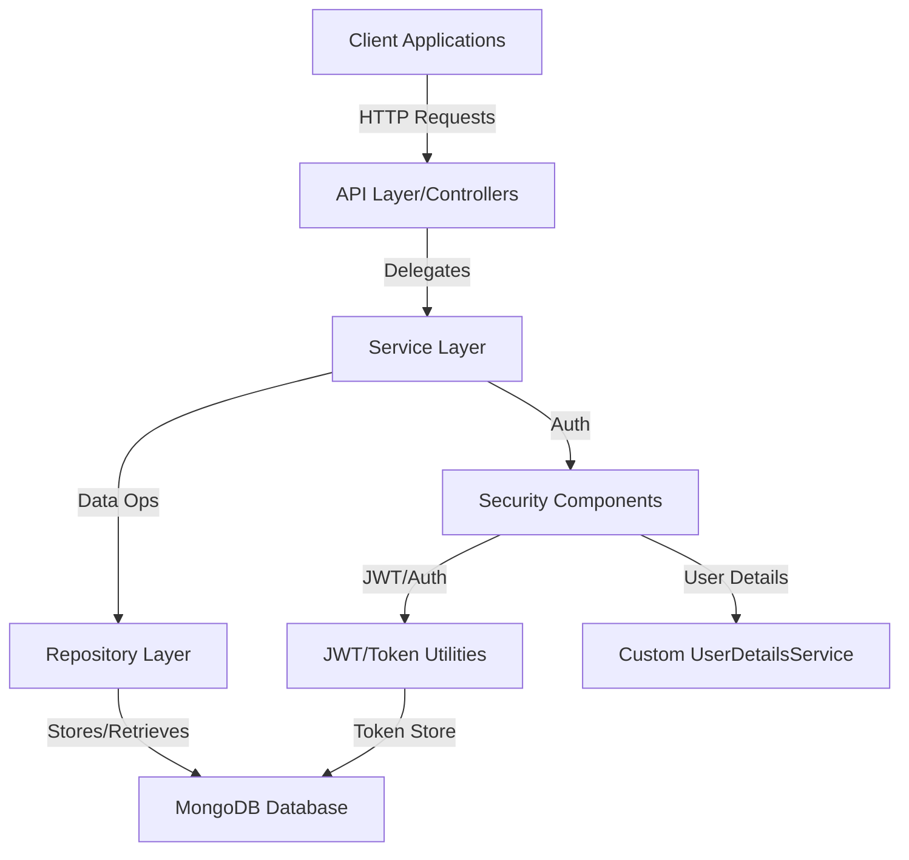
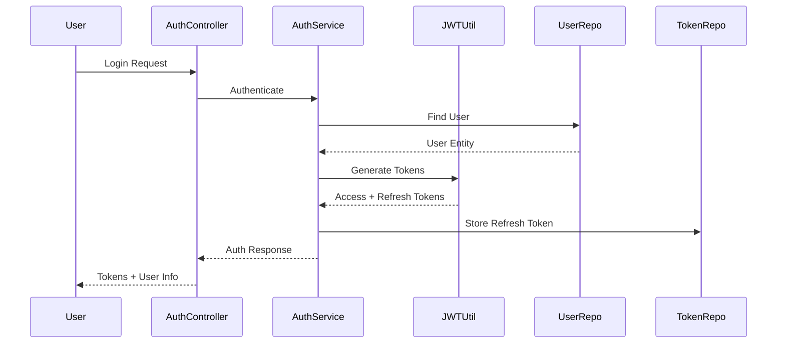
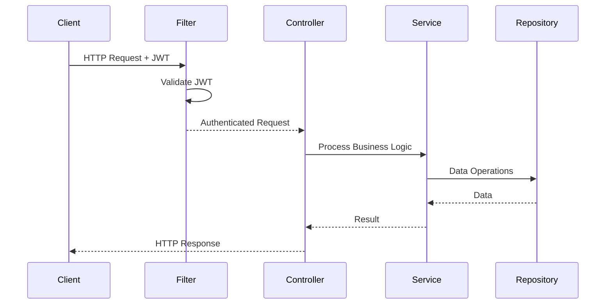

# Architecture Documentation

## System Architecture

The UserService1B is designed as a microservice focusing on user management and authentication. It follows the principles of a layered architecture with clear separation of concerns.

## Component Structure

### Controller Layer
- **AuthController**: Handles authentication requests (login, register, refresh token)
- **UserController**: Handles user profile operations
- **AdminController**: Handles admin-specific operations

### Service Layer
- **AuthenticationService**: Manages authentication processes
- **UserService**: Handles user operations
- **AdminService**: Manages admin operations
- **RefreshTokenService**: Manages refresh token operations

### Repository Layer
- **UserRepository**: Data access for user entities
- **RefreshTokenRepository**: Data access for refresh tokens

### Security Components
- **SecurityConfig**: Spring Security configuration
- **JWTAuthFilter**: JWT authentication filter
- **JWTUtil**: JWT token creation and validation
- **CustomUserDetailsService**: Loads user details for authentication

## Data Flow

### Authentication Flow

### Request Processing Flow

## Technology Stack

- **Java 17**: Core programming language
- **Spring Boot 3.x**: Application framework
- **Spring Security**: Security framework
- **MongoDB**: NoSQL database
- **JWT**: Authentication mechanism
- **Maven**: Build tool

## Design Patterns

- **Repository Pattern**: For data access abstraction
- **Service Layer Pattern**: For business logic encapsulation
- **DTO Pattern**: For data transfer between layers
- **Builder Pattern**: For complex object construction
- **Factory Pattern**: For object creation
- **Strategy Pattern**: For various authentication mechanisms 