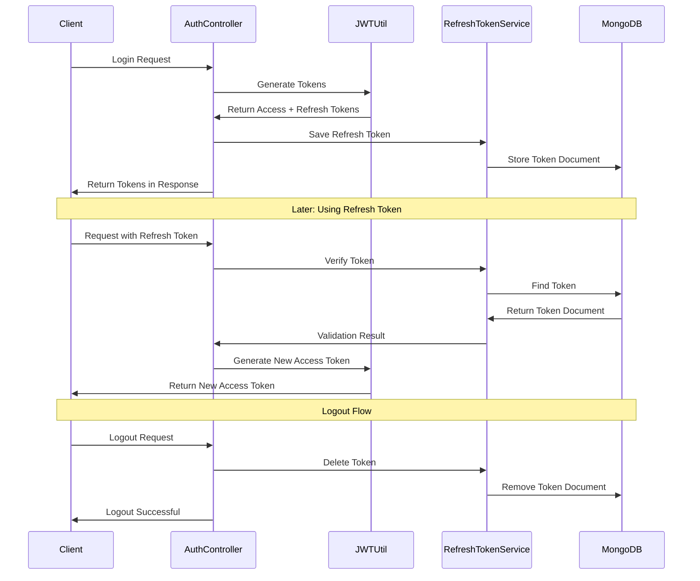

# Refresh Token Implementation and Testing Guide

## Table of Contents
1. [Overview](#overview)
2. [Implementation Details](#implementation-details)
3. [Security Features](#security-features)
4. [Configuration](#configuration)
5. [Testing Guide](#testing-guide)
6. [Future Enhancements](#future-enhancements)

## Overview

This document describes the MongoDB-based refresh token implementation in the User Service API, focusing on the persistent storage mechanism, token lifecycle management, and security enhancements. It also provides comprehensive testing guidelines.

### Package Structure

The refresh token implementation is organized into the following components:

1. **model**: Contains the MongoDB document model for refresh tokens
2. **repository**: Contains repository interface for database operations
3. **service**: Contains services for token management
4. **security**: Contains classes that integrate with the existing security infrastructure

### Token Flow



### Token Lifecycle

1. During login, a refresh token is created and stored in MongoDB
2. The token is associated with a specific user via userId and userEmail
3. When used, the token is validated against the database
4. On logout, the token is deleted from the database
5. Expired tokens are automatically removed via MongoDB TTL index

## Implementation Details

### RefreshToken Model

**Purpose**: MongoDB document model for storing refresh tokens.

**Key Fields**:
- `id`: MongoDB document ID
- `token`: The actual refresh token string (indexed, unique)
- `userId`: ID of the user who owns this token (indexed)
- `userEmail`: Email of the user
- `createdAt`: When the token was created
- `expiryDate`: When the token expires (indexed with TTL)

**Key Methods**:
- `isExpired()`: Checks if the token has expired

### Repository Layer

**Purpose**: MongoDB repository interface for refresh token operations.

**Key Methods**:
- `findByToken(String token)`: Finds a token by its value
- `findByUserId(String userId)`: Finds all tokens for a user
- `findByUserEmail(String userEmail)`: Finds all tokens by user email
- `deleteByToken(String token)`: Deletes a specific token
- `deleteByUserId(String userId)`: Deletes all tokens for a user
- `deleteByUserEmail(String userEmail)`: Deletes all tokens for a user by email
- `deleteByExpiryDateBefore(Instant now)`: Deletes expired tokens

### Service Layer

**Purpose**: Service for managing refresh token operations.

**Key Methods**:
- `createRefreshToken(String userId, String userEmail, String tokenValue, Instant expiryDate)`: Creates and saves a new token
- `findByToken(String token)`: Retrieves a token by its value
- `verifyExpiration(String token)`: Checks if a token exists and is valid
- `deleteToken(String token)`: Deletes a specific token
- `deleteByUserId(String userId)`: Deletes all tokens for a user
- `deleteByUserEmail(String userEmail)`: Deletes all tokens for a user by email
- `removeExpiredTokens()`: Scheduled task to clean up expired tokens

### JWT Integration

**Purpose**: Integration with JWT token generation and validation.

**Key Methods**:
- `generateRefreshToken(UserEntity user)`: Creates a new JWT refresh token and saves it to MongoDB
- `validateRefreshToken(String token)`: Validates token against MongoDB instead of blacklist

## Security Features

### Persistent Storage Benefits

The MongoDB implementation provides several improvements over in-memory storage:
1. **Persistence across restarts**: Tokens survive application restarts
2. **Distributed deployments**: Multiple service instances share the same token storage
3. **Automatic cleanup**: TTL index handles expired token removal without code

### Token Validation Approach

Token validation follows a whitelist approach:
1. A token is only valid if it exists in the database
2. This is more secure than blacklisting, as only explicitly created tokens work
3. Token revocation is immediate by removing from the database

### Multi-Device Support

The implementation supports multiple user sessions:
1. Each login creates a unique token document in MongoDB
2. All active sessions for a user can be queried via userId
3. Selective session termination is possible by deleting specific tokens
4. "Logout everywhere" functionality by deleting all tokens for a user

## Configuration

### Properties
- `security.jwt.refresh-expiration-ms`: Refresh token expiration time in milliseconds (default: 604800000 - 7 days)
- `spring.data.mongodb.uri`: MongoDB connection string
- `spring.data.mongodb.database`: Database name for token storage
- `spring.data.mongodb.auto-index-creation`: Should be true to create TTL indexes

### Best Practices

1. **Token Security**:
   - Whitelist validation approach
   - Unique token indexes
   - Automatic token expiration
   - User-token association

2. **Database Optimization**:
   - Proper indexes for fast queries
   - TTL index for automatic cleanup
   - Minimal document size to conserve space

3. **Security Design**:
   - Clear separation of concerns
   - Transaction support for critical operations
   - Strong user association for improved auditing

## Testing Guide

### Prerequisites
- MongoDB running locally on port 27017 (or configured in application properties)
- UserService1B application running on `http://localhost:8081`
- A tool like curl, Postman, or Insomnia for API testing

### Manual Testing

#### API Endpoints

1. **Register User**
```bash
curl -X POST "http://localhost:8081/api/auth/user/register" \
  -H "Content-Type: application/json" \
  -d '{"email":"test@example.com","password":"Test@123","name":"Test User","roles":["ROLE_USER"]}'
```

2. **Login**
```bash
curl -X POST "http://localhost:8081/api/auth/user/login" \
  -H "Content-Type: application/json" \
  -d '{"email":"test@example.com","password":"Test@123"}' \
  -v
```

3. **Verify Token in MongoDB**
```bash
mongo
use UserDb
db.refresh_tokens.find({userEmail: "test@example.com"})
```

4. **Refresh Access Token**
```bash
curl -X POST "http://localhost:8081/api/auth/refresh-token" \
  -H "Content-Type: application/json" \
  -b "refreshToken=YOUR_REFRESH_TOKEN_VALUE" \
  -v
```

5. **Logout**
```bash
curl -X POST "http://localhost:8081/api/auth/logout" \
  -H "Content-Type: application/json" \
  -H "Authorization: Bearer YOUR_ACCESS_TOKEN" \
  -b "refreshToken=YOUR_REFRESH_TOKEN_VALUE"
```

6. **Logout All Devices**
```bash
curl -X POST "http://localhost:8081/api/auth/logout-all" \
  -H "Content-Type: application/json" \
  -H "Authorization: Bearer YOUR_ACCESS_TOKEN"
```

### Automated Testing

#### Integration Tests

1. **RefreshTokenRepositoryIntegrationTest**
```java
@SpringBootTest
@ActiveProfiles("test")
public class RefreshTokenRepositoryIntegrationTest {
    void testCreateAndFindToken()
    void testDeleteByToken()
    void testFindByUserId()
    void testDeleteByUserId()
}
```

2. **RefreshTokenServiceIntegrationTest**
```java
@SpringBootTest
@ActiveProfiles("test")
public class RefreshTokenServiceIntegrationTest {
    void testCreateRefreshToken()
    void testFindAndVerifyToken()
    void testExpiredToken()
}
```

3. **AuthControllerIntegrationTest**
```java
@SpringBootTest(webEnvironment = SpringBootTest.WebEnvironment.RANDOM_PORT)
@ActiveProfiles("test")
public class AuthControllerIntegrationTest {
    void testLoginCreatesRefreshToken()
    void testLogoutDeletesRefreshToken()
}
```

#### Unit Tests

**RefreshTokenServiceTest**
```java
@ExtendWith(MockitoExtension.class)
public class RefreshTokenServiceTest {
    void testCreateRefreshToken()
    void testVerifyExpiration_ValidToken()
    void testVerifyExpiration_ExpiredToken()
    void testVerifyExpiration_NonexistentToken()
}
```

#### TTL Index Testing

1. Create a token with short expiration:
```java
RefreshToken token = new RefreshToken();
token.setToken("ttl-test-token");
token.setUserId("ttl-user");
token.setUserEmail("ttl@example.com");
token.setCreatedAt(Instant.now());
token.setExpiryDate(Instant.now().plusSeconds(5)); // 5 seconds expiry
```

2. Verify automatic deletion:
```java
refreshTokenRepository.save(token);
Thread.sleep(60000); // Wait for TTL index
Optional<RefreshToken> found = refreshTokenRepository.findByToken("ttl-test-token");
assertFalse(found.isPresent());
```

### Test Coverage Areas

1. **Token Creation**
   - Valid user registration
   - Successful login with token generation
   - Token persistence in MongoDB

2. **Token Usage**
   - Access token refresh
   - Protected resource access
   - Token validation

3. **Token Cleanup**
   - Manual logout
   - Logout from all devices
   - Automatic expiration via TTL

4. **Error Cases**
   - Invalid tokens
   - Expired tokens
   - Non-existent tokens
   - Unauthorized access attempts

## Future Enhancements

1. **Device Tracking**:
   - Add device information to tokens (device type, name, IP)
   - Display active sessions to users in UI
   - Allow selective session termination

2. **Security Improvements**:
   - Rate limiting for refresh token usage
   - Geolocation validation
   - Suspicious activity detection

3. **Performance**:
   - Token rotation policies for long-lived sessions
   - Caching layer for frequently used tokens
   - Bulk operations for mass token management 