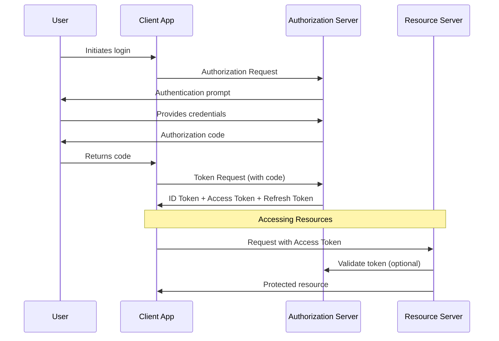

# OAuth 2.0 + OpenID Connect Implementation Guide

## Brief Overview of OAuth 2.0 + OpenID Connect

**OAuth 2.0** is an authorization framework that enables third-party applications to obtain limited access to a user's account on a server without exposing the user's credentials. It focuses on authorization ("what you can do") rather than authentication ("who you are").

**OpenID Connect (OIDC)** is an identity layer built on top of OAuth 2.0 that adds authentication functionality. It allows clients to verify a user's identity and obtain basic profile information in a standardized way.

Key components:
- **Resource Owner**: The user who owns the data
- **Client**: The application requesting access to resources
- **Authorization Server**: Issues tokens after authenticating the user
- **Resource Server**: Hosts the protected resources
- **ID Token**: Contains user identity information (OIDC-specific)
- **Access Token**: Grants access to resources
- **Refresh Token**: Used to obtain new access tokens

## OAuth+OIDC vs. JWT Approach

### Differences

**JWT Approach (as in current implementation)**:
- Self-contained tokens that include all necessary information
- Stateless by default - no server-side storage required
- Simplified implementation for single applications
- Typically managed entirely by your application

**OAuth+OIDC Approach**:
- Standardized protocol for delegated authentication and authorization
- Designed for cross-domain/multi-application scenarios
- Includes well-defined flows for different use cases
- Often involves a separate authorization server

### Can They Be Used Together?

**Yes, they work well together**. In fact, OAuth+OIDC commonly uses JWTs as the token format. The key differences are:

1. In OAuth+OIDC, the JWT is issued by a dedicated authorization server
2. OAuth+OIDC defines specific protocols for token acquisition and validation
3. OAuth+OIDC includes standardized endpoints and flows

### Standard Approach

The standard approach depends on your requirements:

1. **Single Application with Simple Auth Needs**:
   - JWT-based authentication alone may be sufficient

2. **Enterprise Applications or Complex Systems**:
   - OAuth+OIDC is the industry standard
   - JWTs are used as the token format

3. **Hybrid Approach (Most Common)**:
   - Use OAuth+OIDC for authentication and authorization
   - Use JWTs as the token format
   - Implement JWT validation and handling within your services

Modern best practice is to:
1. Use an established identity provider (Keycloak, Auth0, Okta, etc.)
2. Implement OAuth+OIDC flows
3. Use JWTs as the token format
4. Implement proper token validation in your services

## Overview

This document describes the implementation of OAuth 2.0 and OpenID Connect (OIDC) in the User Service API, focusing on standardized authentication and authorization protocols, integration with external identity providers, and secure user management. The implementation provides enhanced security, interoperability, and flexibility compared to custom JWT solutions.

## Authentication Architecture



## 1. Core Components

### 1.1 Authorization Server

The Authorization Server is responsible for authenticating users and issuing tokens. Options include:

1. **External Provider**: Keycloak, Auth0, Okta, etc.
2. **Self-hosted**: Spring Authorization Server

Key responsibilities:
- User authentication
- Token issuance (ID tokens, access tokens, refresh tokens)
- Client application registration and management
- Consent management

### 1.2 Resource Server

The Resource Server hosts protected resources and validates access tokens. In our architecture:

- User Service API acts as a Resource Server
- Validates tokens issued by the Authorization Server
- Enforces access control based on token scopes and claims

### 1.3 Client Application

The Client Application initiates the authentication flow and uses tokens to access resources:

- Web applications (using Authorization Code flow)
- Mobile apps (using PKCE - Proof Key for Code Exchange)
- Single-page applications (using implicit flow or Authorization Code with PKCE)

## 2. Authentication Flows

### 2.1 Authorization Code Flow

The recommended flow for server-side applications:

1. Client redirects user to Authorization Server
2. User authenticates and authorizes the client
3. Authorization Server redirects back with an authorization code
4. Client exchanges code for tokens
5. Client uses access token to call protected APIs

```java
// Spring Security Configuration
@Configuration
@EnableWebSecurity
public class SecurityConfig {

    @Bean
    public SecurityFilterChain filterChain(HttpSecurity http) throws Exception {
        http
            .oauth2Login(oauth2 -> oauth2
                .authorizationEndpoint(auth -> auth
                    .baseUri("/oauth2/authorize")
                    .authorizationRequestRepository(cookieAuthorizationRequestRepository()))
                .redirectionEndpoint(redirect -> redirect
                    .baseUri("/oauth2/callback/*"))
                .userInfoEndpoint(userInfo -> userInfo
                    .userService(customOAuth2UserService))
                .successHandler(oAuth2AuthenticationSuccessHandler)
                .failureHandler(oAuth2AuthenticationFailureHandler)
            )
            .oauth2ResourceServer(OAuth2ResourceServerConfigurer::jwt);
            
        return http.build();
    }
}
```

### 2.2 Client Credentials Flow

Used for service-to-service authentication:

1. Client authenticates directly with Authorization Server
2. Authorization Server issues an access token
3. Client uses the token to access resources

```java
@Configuration
public class OAuth2ClientConfig {

    @Bean
    public OAuth2RestTemplate oauth2RestTemplate(OAuth2ClientContext oauth2ClientContext,
                                                OAuth2ProtectedResourceDetails details) {
        return new OAuth2RestTemplate(details, oauth2ClientContext);
    }
}
```

### 2.3 Refresh Token Flow

Used to obtain new access tokens without re-authentication:

1. Client sends refresh token to Authorization Server
2. Server validates refresh token and issues new access token
3. Client uses new access token for API calls

## 3. Token Management

### 3.1 Token Types

#### ID Token
- JSON Web Token (JWT) that contains user identity information
- Used for authentication purposes
- Contains standard claims: `sub`, `iss`, `aud`, `exp`, etc.
- May include additional user information

#### Access Token
- Grants access to protected resources
- Can be JWT or opaque
- Contains scopes that define permissions
- Short-lived (typically 5-60 minutes)

#### Refresh Token
- Used to obtain new access tokens
- Long-lived (days to weeks)
- Secure storage essential

### 3.2 Token Validation

```java
@Service
public class TokenValidator {

    private final JwtDecoder jwtDecoder;
    
    public TokenValidator(JwtDecoder jwtDecoder) {
        this.jwtDecoder = jwtDecoder;
    }
    
    public Jwt validateToken(String token) {
        try {
            return jwtDecoder.decode(token);
        } catch (JwtException e) {
            throw new InvalidTokenException("Invalid JWT token: " + e.getMessage());
        }
    }
    
    public boolean hasScope(Jwt jwt, String scope) {
        return jwt.getClaimAsStringList("scope").contains(scope);
    }
}
```

### 3.3 Token Storage

Recommended approach for refresh tokens:

1. Store in MongoDB with appropriate security measures
2. Implement token rotation strategy
3. Associate tokens with specific devices/sessions

## 4. Integration with Spring Security

### 4.1 Resource Server Configuration

```java
@Configuration
@EnableWebSecurity
@EnableGlobalMethodSecurity(prePostEnabled = true)
public class ResourceServerConfig extends WebSecurityConfigurerAdapter {

    @Override
    protected void configure(HttpSecurity http) throws Exception {
        http
            .cors()
                .and()
            .sessionManagement()
                .sessionCreationPolicy(SessionCreationPolicy.STATELESS)
                .and()
            .csrf()
                .disable()
            .formLogin()
                .disable()
            .httpBasic()
                .disable()
            .authorizeRequests()
                .antMatchers("/api/public/**")
                    .permitAll()
                .anyRequest()
                    .authenticated()
                .and()
            .oauth2ResourceServer()
                .jwt()
                    .jwtAuthenticationConverter(jwtAuthenticationConverter());
    }
    
    private JwtAuthenticationConverter jwtAuthenticationConverter() {
        JwtGrantedAuthoritiesConverter jwtGrantedAuthoritiesConverter = new JwtGrantedAuthoritiesConverter();
        jwtGrantedAuthoritiesConverter.setAuthoritiesClaimName("roles");
        jwtGrantedAuthoritiesConverter.setAuthorityPrefix("ROLE_");
        
        JwtAuthenticationConverter jwtAuthenticationConverter = new JwtAuthenticationConverter();
        jwtAuthenticationConverter.setJwtGrantedAuthoritiesConverter(jwtGrantedAuthoritiesConverter);
        return jwtAuthenticationConverter;
    }
}
```

### 4.2 Method-Level Security

```java
@RestController
@RequestMapping("/api/users")
public class UserController {

    @PreAuthorize("hasRole('ADMIN')")
    @GetMapping("/admin/all")
    public List<UserDto> getAllUsers() {
        // Implementation
    }
    
    @PreAuthorize("hasAnyRole('USER', 'ADMIN')")
    @GetMapping("/profile")
    public UserDto getUserProfile() {
        // Implementation
    }
    
    @PreAuthorize("#userId == authentication.principal.userId or hasRole('ADMIN')")
    @PutMapping("/{userId}")
    public UserDto updateUser(@PathVariable String userId, @RequestBody UserDto userDto) {
        // Implementation
    }
}
```

## 5. Keycloak Integration Example

### 5.1 Keycloak Configuration

```yaml
# application.yml
spring:
  security:
    oauth2:
      resourceserver:
        jwt:
          issuer-uri: http://localhost:8080/auth/realms/myrealm
          jwk-set-uri: http://localhost:8080/auth/realms/myrealm/protocol/openid-connect/certs
```

### 5.2 Keycloak Client Setup

1. Create a new realm in Keycloak
2. Create a client for your application
   - Set Access Type to "confidential"
   - Enable "Standard Flow" and "Direct Access Grants"
   - Configure valid redirect URIs
3. Create roles and assign them to users
4. Configure mappers to include user roles in tokens

## 6. Multi-Tenant Implementation

For applications requiring multi-tenancy:

```java
@Component
public class TenantJwtAuthenticationConverter implements Converter<Jwt, AbstractAuthenticationToken> {

    private final JwtGrantedAuthoritiesConverter defaultGrantedAuthoritiesConverter = new JwtGrantedAuthoritiesConverter();
    
    @Override
    public AbstractAuthenticationToken convert(Jwt jwt) {
        Collection<GrantedAuthority> authorities = defaultGrantedAuthoritiesConverter.convert(jwt);
        
        String tenantId = jwt.getClaimAsString("tenant_id");
        if (tenantId == null) {
            tenantId = "default";
        }
        
        return new TenantJwtAuthenticationToken(jwt, authorities, jwt.getSubject(), tenantId);
    }
}
```

## 7. Testing OAuth/OIDC Implementation

### 7.1 Unit Testing

```java
@ExtendWith(MockitoExtension.class)
public class OAuth2SecurityTest {

    private MockMvc mockMvc;
    
    @Mock
    private JwtDecoder jwtDecoder;
    
    @InjectMocks
    private ResourceServerConfig resourceServerConfig;
    
    @BeforeEach
    public void setup() {
        this.mockMvc = MockMvcBuilders
            .standaloneSetup(new TestController())
            .apply(springSecurity(resourceServerConfig))
            .build();
    }
    
    @Test
    public void givenValidToken_whenGetSecuredEndpoint_thenSuccess() throws Exception {
        Jwt jwt = Jwt.withTokenValue("token")
            .header("alg", "RS256")
            .claim("sub", "user")
            .claim("scope", "read")
            .build();
            
        when(jwtDecoder.decode(anyString())).thenReturn(jwt);
        
        mockMvc.perform(get("/api/secured")
            .header("Authorization", "Bearer token"))
            .andExpect(status().isOk());
    }
}
```

### 7.2 Integration Testing

Using TestRestTemplate with OAuth2 support:

```java
@SpringBootTest(webEnvironment = WebEnvironment.RANDOM_PORT)
public class OAuth2IntegrationTest {

    @Autowired
    private TestRestTemplate restTemplate;
    
    @Test
    public void givenValidToken_whenGetSecuredResource_thenSuccess() {
        // Get token from authorization server
        // ...
        
        HttpHeaders headers = new HttpHeaders();
        headers.add("Authorization", "Bearer " + accessToken);
        
        ResponseEntity<String> response = restTemplate.exchange(
            "/api/users/profile",
            HttpMethod.GET,
            new HttpEntity<>(headers),
            String.class);
            
        assertEquals(HttpStatus.OK, response.getStatusCode());
    }
}
```

## 8. Comparison with JWT-only Approach

| Feature | OAuth+OIDC | JWT-only |
|---------|-----------|----------|
| Standards Compliance | High (industry standard protocols) | Medium (depends on implementation) |
| Interoperability | High (works with many identity providers) | Low (custom implementation) |
| Security | High (established security patterns) | Medium (depends on implementation) |
| Complexity | Higher (more components) | Lower (simpler architecture) |
| Scalability | High (supports distributed systems) | Medium (may require custom solutions) |
| Token Revocation | Supported (standardized endpoints) | Custom implementation required |
| User Management | Often delegated to identity provider | Custom implementation required |

## 9. Migration Strategy from JWT to OAuth+OIDC

### 9.1 Phased Approach

1. **Phase 1: Preparation**
   - Set up identity provider (e.g., Keycloak)
   - Configure clients and realms
   - Migrate user data to identity provider

2. **Phase 2: Dual Support**
   - Support both JWT and OAuth+OIDC authentication
   - Implement adapter patterns to normalize user details
   - Gradually move clients to OAuth+OIDC

3. **Phase 3: Complete Migration**
   - Deprecate JWT-only endpoints
   - Finalize OAuth+OIDC implementation
   - Monitor and optimize

### 9.2 Code Example for Dual Support

```java
@Component
public class DualAuthenticationConverter implements Converter<Jwt, AbstractAuthenticationToken> {

    private final JwtAuthenticationConverter jwtAuthConverter;
    private final OidcAuthenticationConverter oidcAuthConverter;
    
    @Override
    public AbstractAuthenticationToken convert(Jwt jwt) {
        // Check if it's an OIDC token (has standard OIDC claims)
        if (jwt.containsClaim("iss") && jwt.containsClaim("aud")) {
            return oidcAuthConverter.convert(jwt);
        } else {
            // Legacy JWT format
            return jwtAuthConverter.convert(jwt);
        }
    }
}
```

## 10. Recommended Identity Providers

1. **Keycloak**
   - Open-source
   - Self-hosted
   - Complete identity and access management
   - Supports OAuth 2.0, OIDC, SAML

2. **Auth0**
   - Cloud-based
   - Easy to integrate
   - Extensive documentation
   - Free tier available

3. **Okta**
   - Enterprise-focused
   - Comprehensive identity platform
   - Advanced security features
   - Free tier for development

4. **Spring Authorization Server**
   - Native Spring integration
   - Customizable
   - Lighter weight
   - Under active development

## 11. Best Practices

1. **Security**
   - Use HTTPS everywhere
   - Implement PKCE for public clients
   - Use short-lived access tokens
   - Store refresh tokens securely
   - Implement proper scope validation

2. **User Experience**
   - Smooth login/logout flows
   - Minimize redirects
   - Implement silent token refresh
   - Provide clear consent screens

3. **Performance**
   - Cache token validation results
   - Implement efficient token validation strategies
   - Monitor token usage and expiration

4. **Maintenance**
   - Keep identity provider updated
   - Rotate signing keys periodically
   - Audit token usage regularly
   - Implement monitoring for suspicious activities 