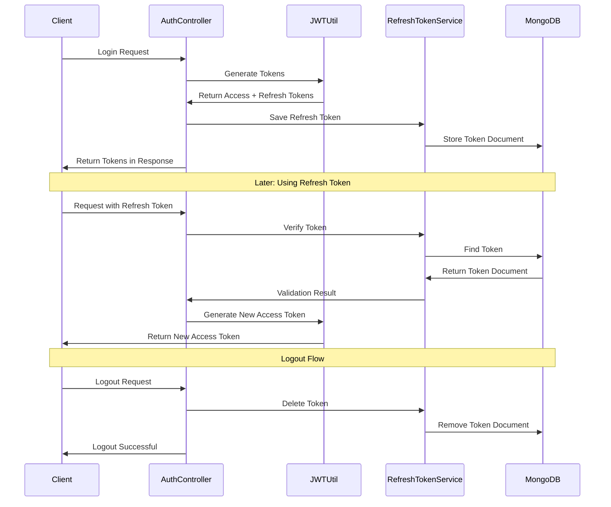

# MongoDB Refresh Token Implementation

## Overview

This document describes the MongoDB-based refresh token implementation in the User Service API, focusing on the persistent storage mechanism, token lifecycle management, and security enhancements over the previous in-memory solution. The refresh token system is structured into several components, each responsible for specific aspects of token creation, validation, and revocation.

## Package Structure

The refresh token implementation is organized into the following components:

1. **model**: Contains the MongoDB document model for refresh tokens
2. **repository**: Contains repository interface for database operations
3. **service**: Contains services for token management
4. **security**: Contains classes that integrate with the existing security infrastructure

## 1. Refresh Token Flow

### Token Lifecycle:

1. During login, a refresh token is created and stored in MongoDB
2. The token is associated with a specific user via userId and userEmail
3. When used, the token is validated against the database
4. On logout, the token is deleted from the database
5. Expired tokens are automatically removed via MongoDB TTL index

## 2. Class and Method Descriptions

### 2.1 RefreshToken

**Purpose**: MongoDB document model for storing refresh tokens.

**Key Fields**:
- `id`: MongoDB document ID
- `token`: The actual refresh token string (indexed, unique)
- `userId`: ID of the user who owns this token (indexed)
- `userEmail`: Email of the user
- `createdAt`: When the token was created
- `expiryDate`: When the token expires (indexed with TTL)

**Key Methods**:
- `isExpired()`: Checks if the token has expired

### 2.2 RefreshTokenRepository

**Purpose**: MongoDB repository interface for refresh token operations.

**Key Methods**:
- `findByToken(String token)`: Finds a token by its value
- `findByUserId(String userId)`: Finds all tokens for a user
- `findByUserEmail(String userEmail)`: Finds all tokens by user email
- `deleteByToken(String token)`: Deletes a specific token
- `deleteByUserId(String userId)`: Deletes all tokens for a user
- `deleteByUserEmail(String userEmail)`: Deletes all tokens for a user by email
- `deleteByExpiryDateBefore(Instant now)`: Deletes expired tokens

### 2.3 RefreshTokenService

**Purpose**: Service for managing refresh token operations.

**Key Methods**:
- `createRefreshToken(String userId, String userEmail, String tokenValue, Instant expiryDate)`: Creates and saves a new token
- `findByToken(String token)`: Retrieves a token by its value
- `verifyExpiration(String token)`: Checks if a token exists and is valid
- `deleteToken(String token)`: Deletes a specific token
- `deleteByUserId(String userId)`: Deletes all tokens for a user
- `deleteByUserEmail(String userEmail)`: Deletes all tokens for a user by email
- `removeExpiredTokens()`: Scheduled task to clean up expired tokens

### 2.4 JWTUtil (Updated)

**Purpose**: Provides utilities for JWT token generation, now integrated with RefreshTokenService.

**Key Methods**:
- `generateRefreshToken(UserEntity user)`: Creates a new JWT refresh token and saves it to MongoDB
- `validateRefreshToken(String token)`: Validates token against MongoDB instead of blacklist

## 3. Security Improvements

### 3.1 Persistent Storage

The MongoDB implementation provides several improvements over in-memory storage:
1. **Persistence across restarts**: Tokens survive application restarts
2. **Distributed deployments**: Multiple service instances share the same token storage
3. **Automatic cleanup**: TTL index handles expired token removal without code

### 3.2 Token Validation

Token validation now follows a whitelist approach instead of blacklist:
1. A token is only valid if it exists in the database
2. This is more secure than blacklisting, as only explicitly created tokens work
3. Token revocation is immediate by removing from the database

### 3.3 Multi-Device Support

The implementation supports multiple user sessions:
1. Each login creates a unique token document in MongoDB
2. All active sessions for a user can be queried via userId
3. Selective session termination is possible by deleting specific tokens
4. "Logout everywhere" functionality by deleting all tokens for a user

## 4. Configuration Properties

- `security.jwt.refresh-expiration-ms`: Refresh token expiration time in milliseconds (default: 604800000 - 7 days)
- `spring.data.mongodb.uri`: MongoDB connection string
- `spring.data.mongodb.database`: Database name for token storage
- `spring.data.mongodb.auto-index-creation`: Should be true to create TTL indexes

## 5. Best Practices Implemented

1. **Token Security**:
   - Whitelist validation approach
   - Unique token indexes
   - Automatic token expiration
   - User-token association

2. **Database Optimization**:
   - Proper indexes for fast queries
   - TTL index for automatic cleanup
   - Minimal document size to conserve space

3. **Security Design**:
   - Clear separation of concerns
   - Transaction support for critical operations
   - Strong user association for improved auditing

## 6. Future Enhancements

1. **Device Tracking**:
   - Add device information to tokens (device type, name, IP)
   - Display active sessions to users in UI
   - Allow selective session termination

2. **Security Improvements**:
   - Rate limiting for refresh token usage
   - Geolocation validation
   - Suspicious activity detection

3. **Performance**:
   - Token rotation policies for long-lived sessions
   - Caching layer for frequently used tokens
   - Bulk operations for mass token management 